# Shapley values

The code related to this subject can be found in `Shapley.ipynb` file.

We considered the problem of `Fair division of taxi fare`:
 - Multiple agents onboard on a taxi trip
 - The amount the agents have to pay is given by the distance to the last stop.

## Shapley values computation

The exact shapley values were computed for a considerably small problem size: n = {4, 5}. 

For bigger problem sizes, computing the exact shapley values with the proposed method, is computationally intractable due to the fact that 2 ^ n permutations of agents must be taken into consideration.

## Estimation of shapley values

Instead of processing 2 ^ n permutations, a smaller number of permutation are sampled and estimates of exact shapley values are produced.

Considering n = 100 agents, 10 experiments were conducted with different numbers of samples: [10, 50, 100, 500, 1000, 5000, 10000].

Arguably, for this problem size, by sampling more the 5000 permutations, the estimates stabilizes.

### 10 samples of permutations
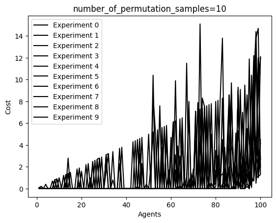

### 50 samples of permutations
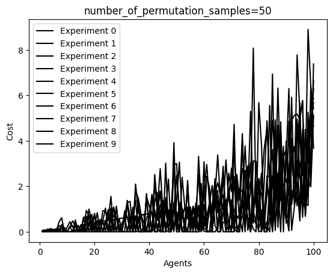

### 100 samples of permutations
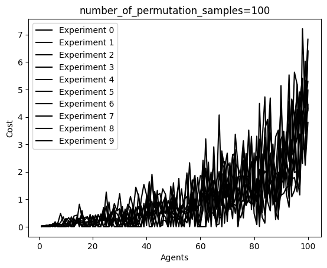

### 500 samples of permutations
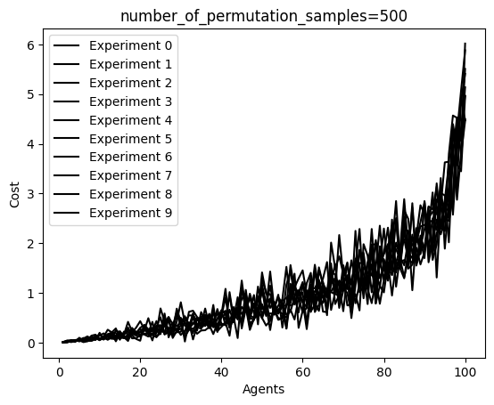

### 1000 samples of permutations
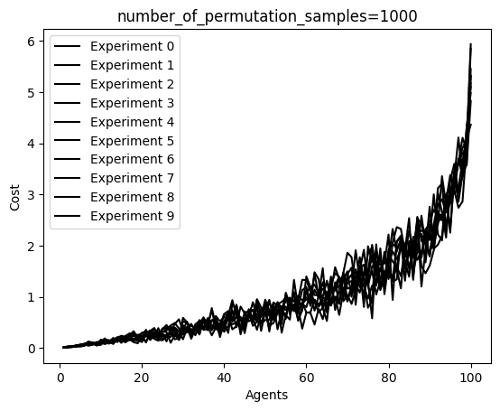

### 5000 samples of permutations
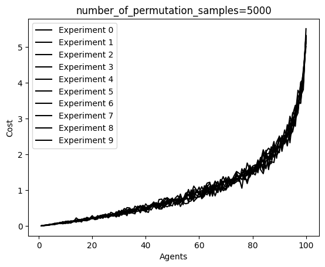

### 10000 samples of permutations
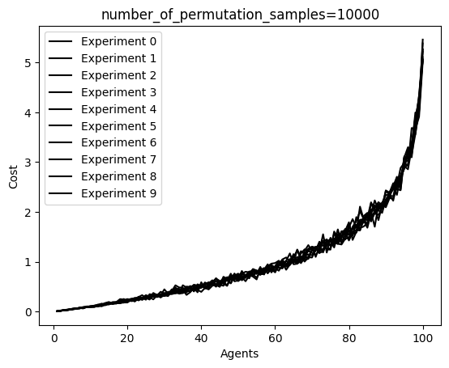

# Reinforcement Learning

## Sarsa with epsilon greedy policy
The code related to this subject can be found in `ReinforcementLearning.ipynb` file.

An epsilon-greedy SARSA solution was provided for the dummy 9x9 world.

Multiple experiments were performed with the agent being spawned at random valid positions.

The experiment's static `hyperparameters` are:
 - Number of epochs: `epochs = 2000`
 - Learning rate: `alpha = 0.1`
 - Discount factor: `gamma = 0.9`

Eleven experiments were conducted with `epsilon` values sampled from the following set {0.0, 0.1, 0.2, 0.3, 0.4, 0.5, 0.6, 0.7, 0.8, 0.9, 1.0}
 - Note: 
    - `epsilon` is the parameter that drives the `exploration` vs `exploitation` trade off. 
    - Agent can choose between:
        - 1. Random action (`exploration`)
        - 2. Most probable best action (`exploitation`)
    - As `epsilon` increases, the `exploration` increases
    - As `epsilon` decreases, the `exploitation` increases

The experimental results will be presented next. We care to note the followings:
 - When `epsilon` is small, the agent manages to construct some particular paths to the `Treasure` while leaving a lot of the other state space unexplored.
 - As `epsilon` increases, the agent manages to reveal a global overview of the world.
 - Even though exploration comes with the cost of worse rewards in some epochs, I argue it's an important aspect even in this trivial 9x9 world.

### `epsilon=0.0`
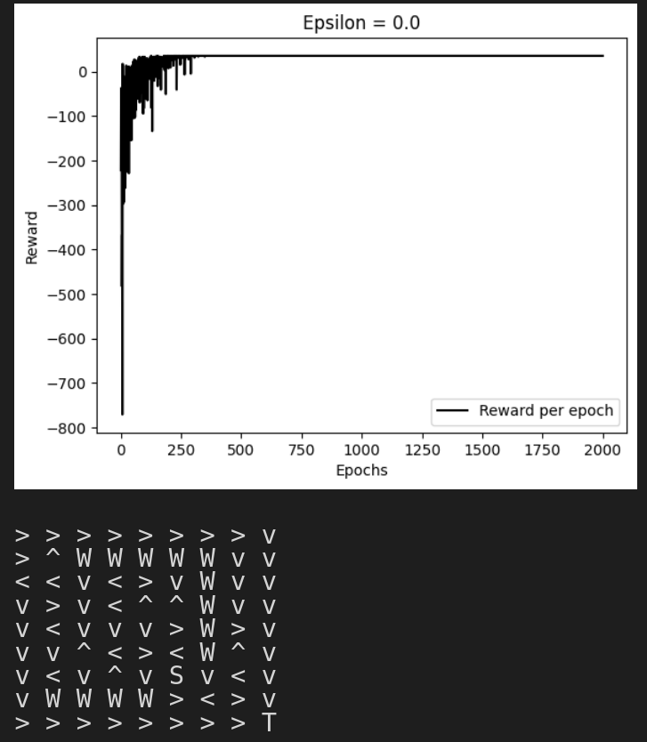

### `epsilon=0.1`
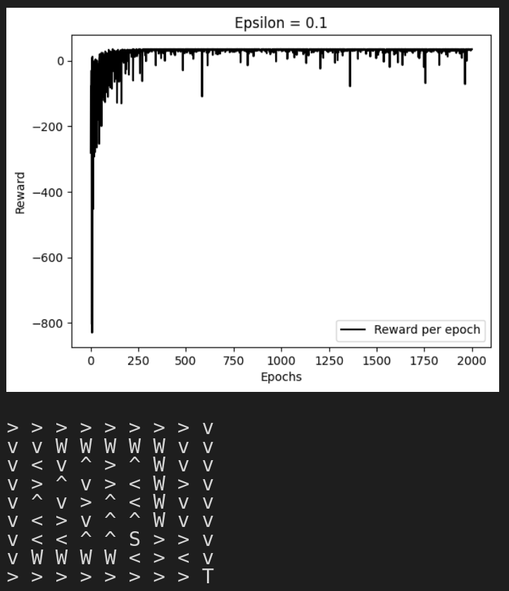

### `epsilon=0.2`
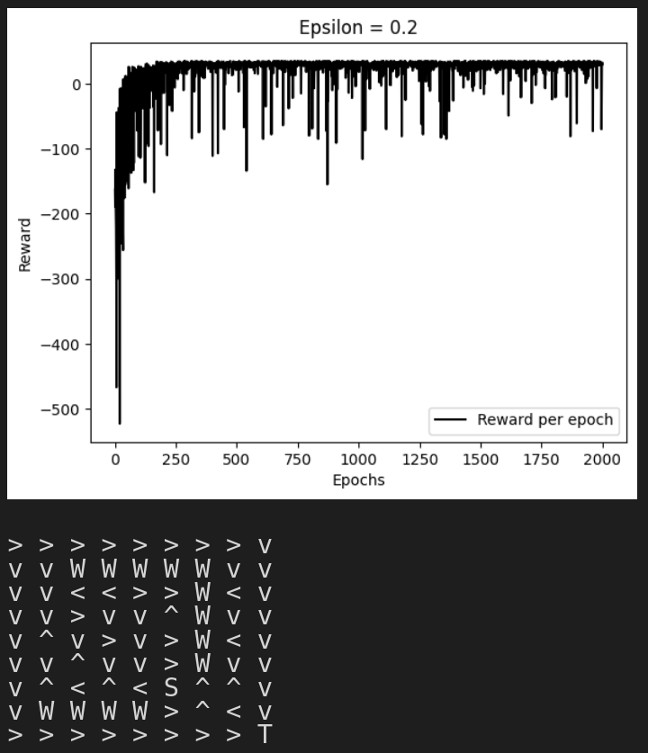

### `epsilon=0.3`
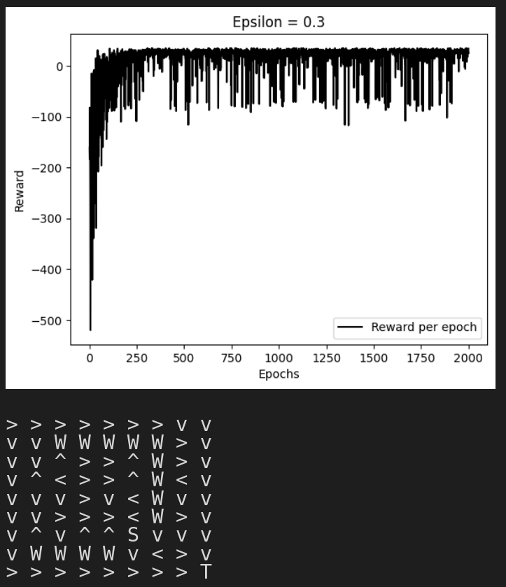

### `epsilon=0.4`
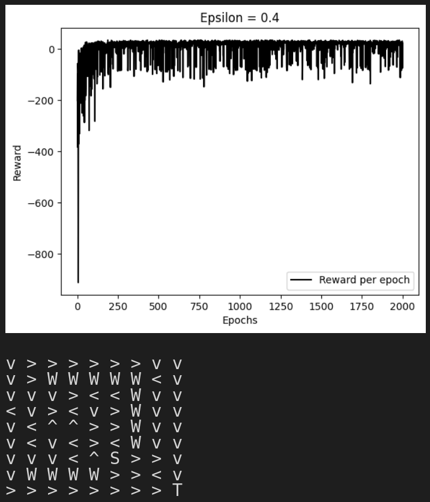

### `epsilon=0.5`
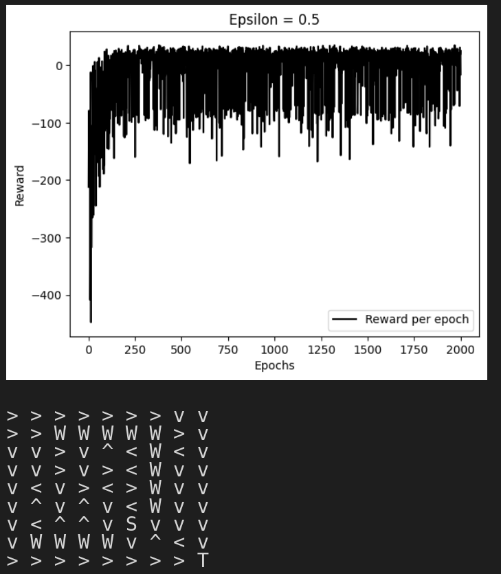

### `epsilon=0.6`

### `epsilon=0.7`
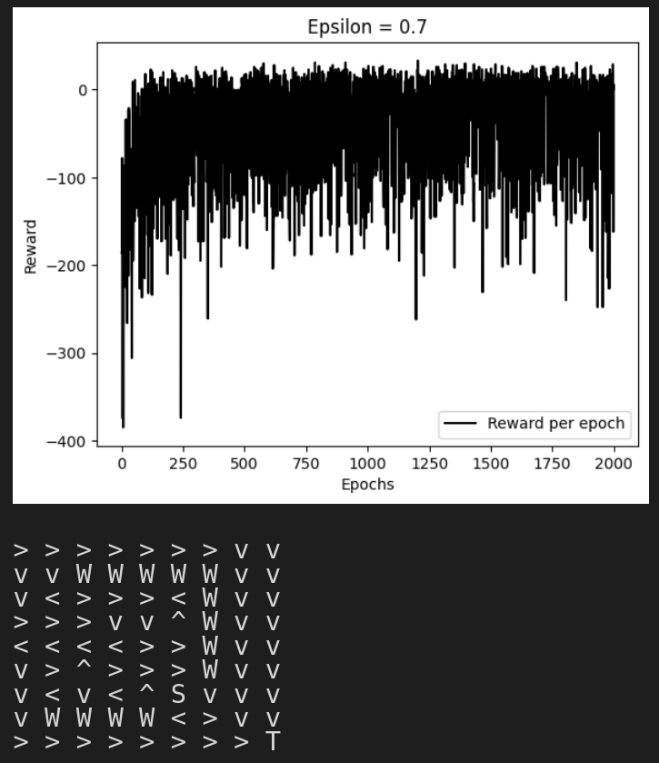

### `epsilon=0.8`
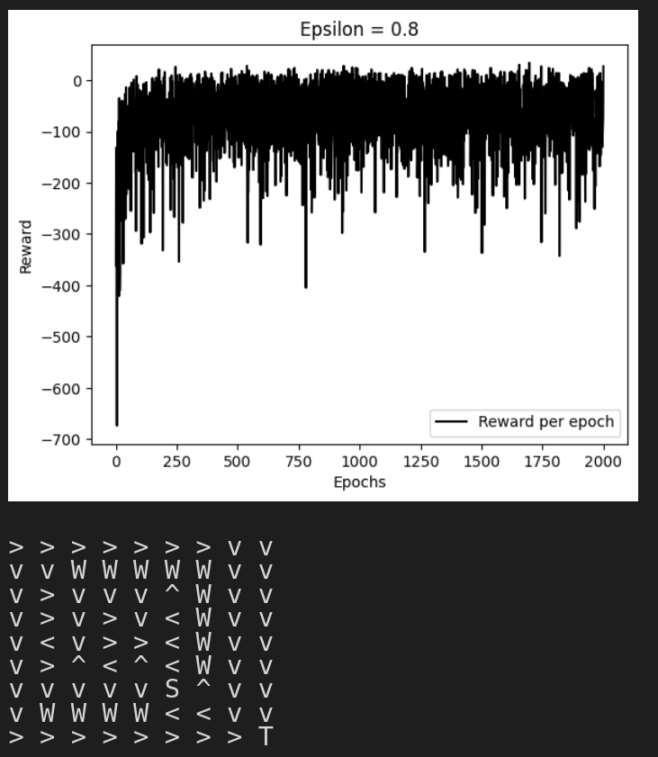

### `epsilon=0.9`
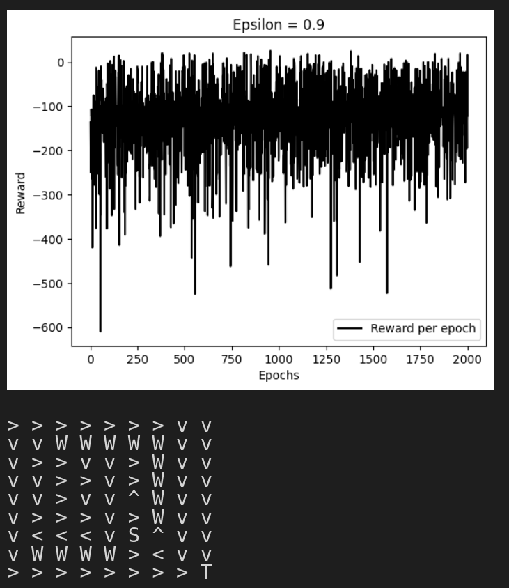

### `epsilon=1.0`

